# CourseSales
在线课程售卖系统  系统亮点：DeepSeek AI多轮问答、协同过滤算法推荐、ECharts经营数据看板、课程发布审核与上下架、视频章节学习和学习记录、订单支付取消退款、售课者提现、课程收藏与提问回复； 角色：学习者、售课者、管理员；

所有源码均本人开发，项目是前后端分离的，所有的项目都具备了完整的业务逻辑，不仅仅局限于基础的增删改查（CRUD）操作，系统亮点众多。

本文注重于计算机毕业设计选题指导，列出题目均有源码， 大家可以去【公众号】(毕业终点站)获取或者加我【qq】(2112698948)提意见(别忘记Star哟)。备注：git

声明：仅用于学习使用，请勿用于任何商业行为！

1.系统非商用，非开源，非无偿。

2.由本人开发，如需源码，请联系以下方式，qq:2112698948。

3.项目有很多，并未全部上传，如果未找到想要的，可直接咨询。

# 在线课程售卖系统

> 面向学习者、售课者与管理员的在线课程售卖平台：涵盖课程发布审核、视频章节学习、DeepSeek AI 多轮问答、协同过滤推荐、订单支付退款、售课者提现与 ECharts 经营数据看板。

**系统亮点**：DeepSeek AI多轮问答、协同过滤算法推荐、ECharts经营数据看板、课程发布审核与上下架、视频章节学习和学习记录、订单支付取消退款、售课者提现、课程收藏与提问回复

## 一、项目简介

在线课程售卖系统采用前后端分离架构，面向学习者、售课者和管理员构建“课程发布—平台审核—上架选购—订单支付—在线学习—互动答疑—售后退款—收益提现—运营分析”的服务流程。学习者可浏览课程中心，按课程名称和分类筛选已上架课程，查看课程详情、讲师信息与章节目录，收藏课程、提交课程提问，创建订单并完成支付；购买后可在“我的课程”中观看章节视频并保存学习记录，在个人中心查看订单和收藏内容。售课者可维护个人课程、课程章节、订单、公告与问答，查看课程审核状态、订单状态、各课程销量和收入，并提交提现申请。管理员负责用户账号、课程分类、课程审核与上下架、课程章节、学习记录、收藏、公告、订单、退款、提现及问答的统一维护，同时通过数据看板查看课程分类、订单状态、用户角色、近 7 天成交趋势和课程销量排行。

## 二、技术架构

| 层级 | 主要技术与职责 |
| :--- | :--- |
| 学习者服务端 | 基于 Vue 3、Vite、Element Plus、Pinia、Vue Router 和 Axios 构建，提供课程浏览与筛选、课程详情、购买支付、课程收藏、我的订单、我的课程、视频学习、学习记录、课程提问回复、个人资料和 AI 问答等功能。 |
| 售课者工作台 | 基于 Vue 3、Element Plus 和 ECharts 实现。售课者可发布及维护课程和视频章节，查看审核状态、订单、课程问答和公告，提交提现申请，并通过课程状态、订单状态、销量和收入图表了解经营情况。 |
| 管理工作台 | 基于 Vue 3、Element Plus 和 ECharts 实现。管理员可维护账号、课程分类、课程、章节、学习及收藏记录、公告、订单、退款、提现和课程问答，审核课程和退款申请，并查看平台经营数据。 |
| 服务端 | 基于 Spring Boot 3、Java 17、Spring MVC、MyBatis-Plus、MySQL 和 JWT 提供 REST 接口、分页查询、文件上传、当前用户身份解析、统一响应与异常处理及数据持久化能力。 |
| 智能与推荐能力 | 接入 DeepSeek 对话模型并通过 LangChain4j 维护 AI 会话及历史消息上下文；针对课程购买和收藏行为识别具有相同学习偏好的用户，推荐其已购买而当前用户未接触的已上架课程，推荐结果不足时以热门课程补充。 |

## 三、核心业务流程

**课程发布与审核**：售课者发布课程与视频章节，管理员审核上架；
**选购与支付**：学习者按名称/分类筛选课程，查看详情后创建订单并在线支付；
**在线学习与记录**：购买后在「我的课程」观看章节视频，系统自动保存学习进度；
**互动答疑**：学习者收藏课程、提交提问，售课者/管理员回复；AI 助手基于 DeepSeek 提供多轮问答；
**协同推荐**：依据购买与收藏行为识别相似兴趣用户，推荐其已购而当前用户未接触的已上架课程，数量不足时以热门课程补充；
**售后与结算**：支持订单取消与退款申请（管理员审核），售课者提交提现申请，平台审批打款；
**运营分析**：通过 ECharts 看板查看课程分类、订单状态、用户角色、近 7 天成交趋势与课程销量排行。

## 四、界面展示

以下截图来自实际运行环境，按角色分三个工作台展示。

### 4.1 系统总览

**图 01 · 系统总览**：平台整体功能与角色入口一览

### 4.2 学习者端（2.1）

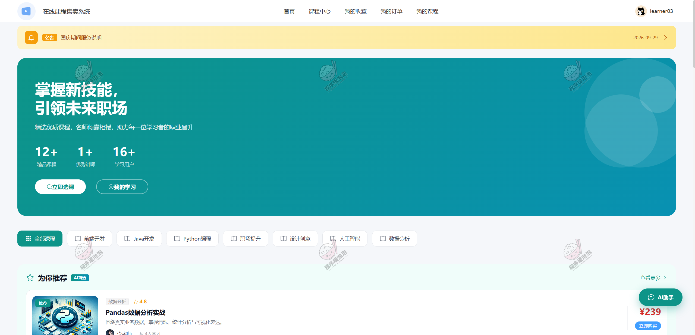

**图 02 · 首页**：课程推荐、分类导航与 AI 问答入口

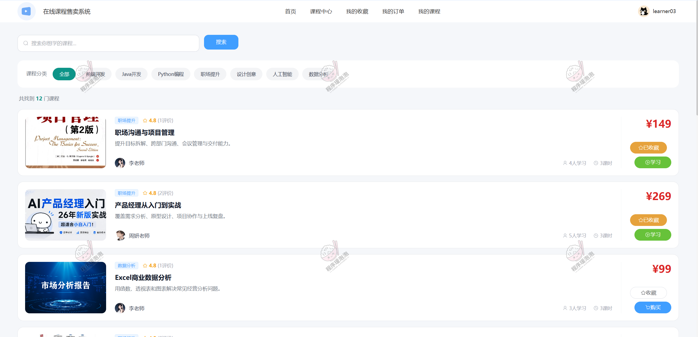

**图 03 · 课程中心**：按名称与分类筛选已上架课程

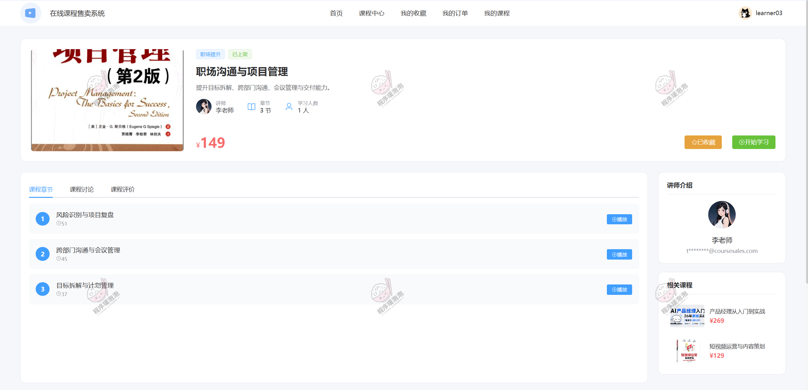

**图 04 · 课程详情**：讲师信息、章节目录、收藏与提问

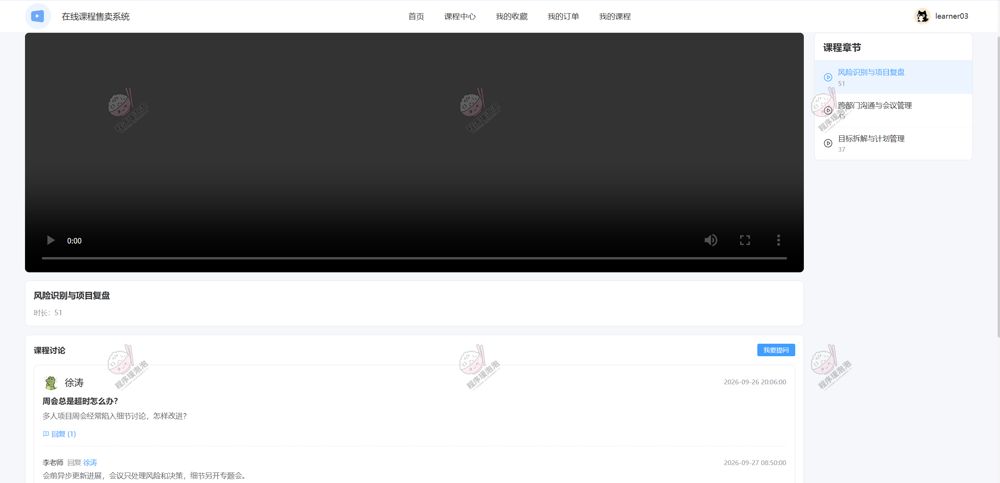

**图 05 · 学习课程**：观看章节视频并保存学习记录

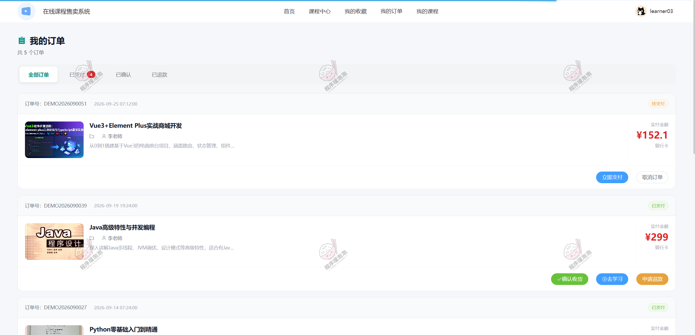

**图 06 · 我的课程**：已购课程与学习进度管理

### 4.3 售课者端（2.2）

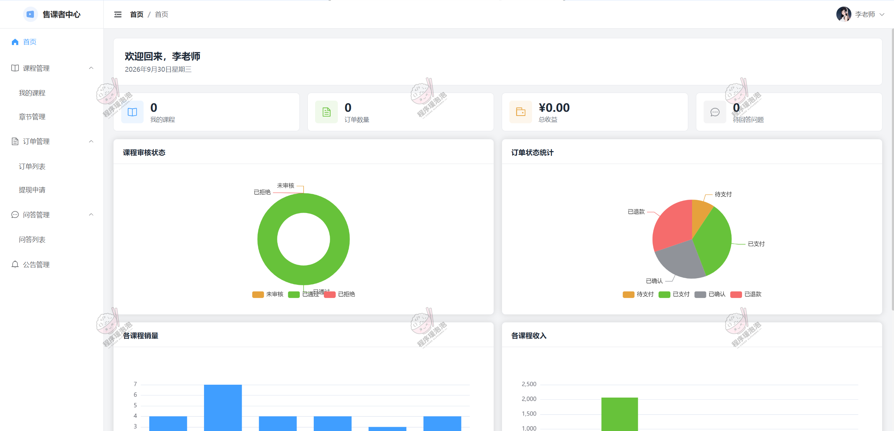

**图 07 · 数据分析**：课程状态、订单、销量与收入图表

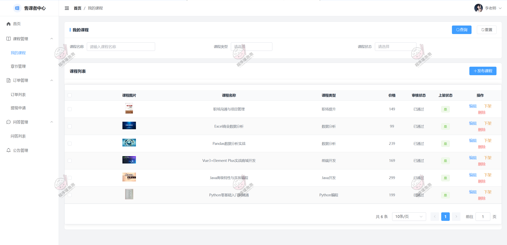

**图 08 · 我的课程**：售课者维护课程与视频章节

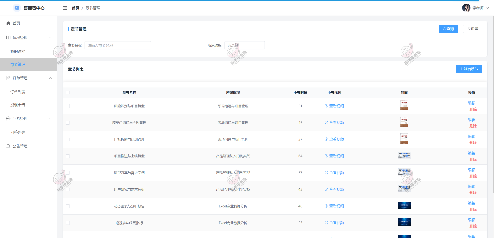

**图 09 · 章节管理**：上传与编排课程视频章节

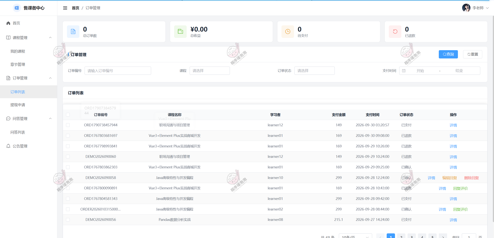

**图 10 · 订单列表**：查看课程订单与状态

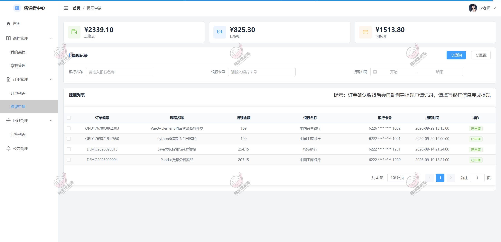

**图 11 · 提现申请**：提交并跟踪收益提现

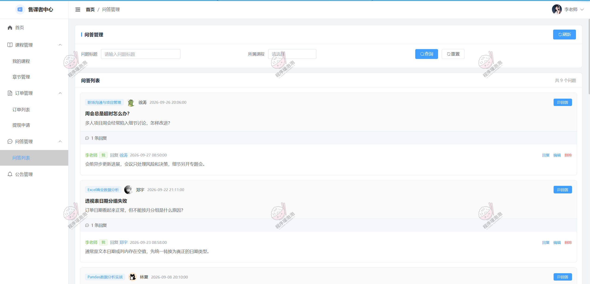

**图 12 · 问答列表**：回复学习者课程提问

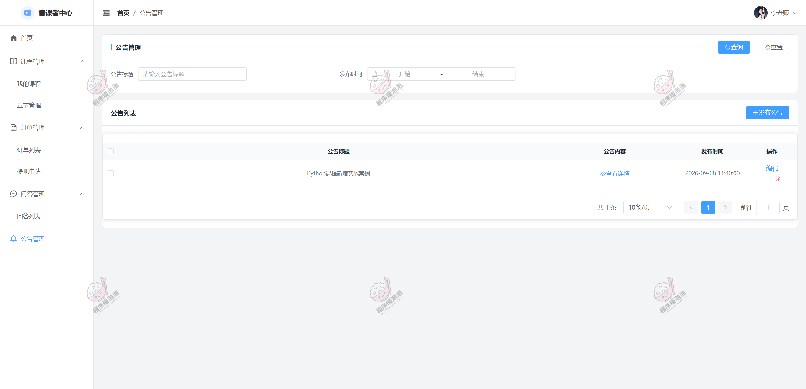

**图 13 · 公告信息**：发布与维护平台公告

### 4.4 管理员端（2.3）

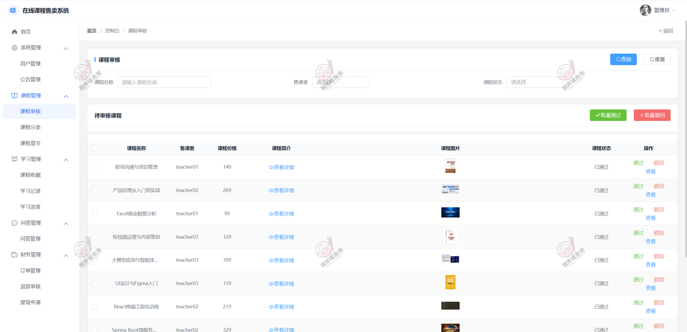

**图 14 · 课程审核**：审核课程上架与下架

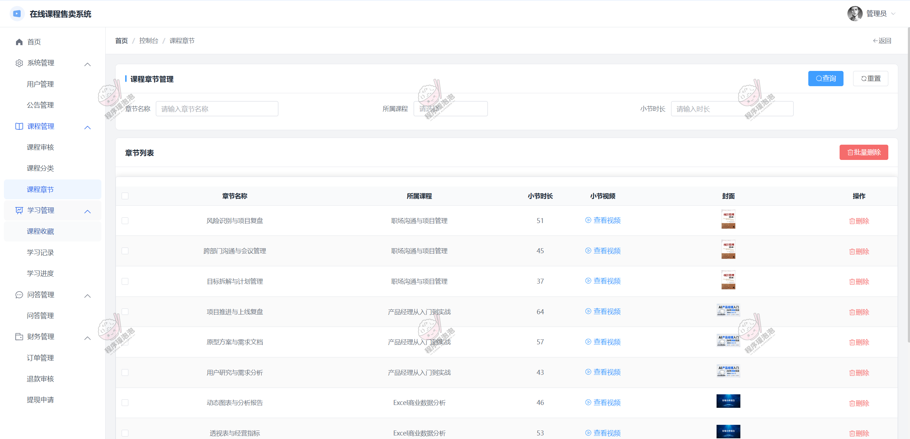

**图 15 · 课程章节**：管理员维护课程章节内容

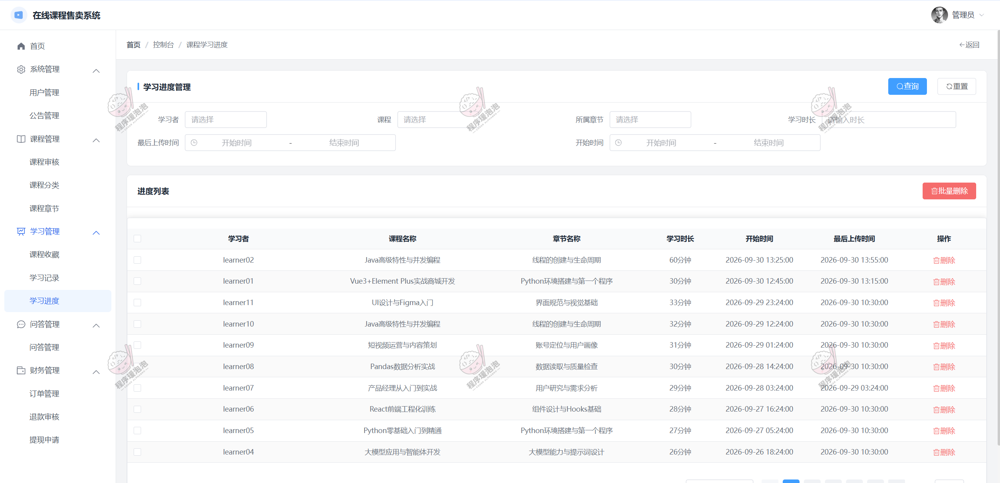

**图 16 · 学习进度**：查看全平台学习记录

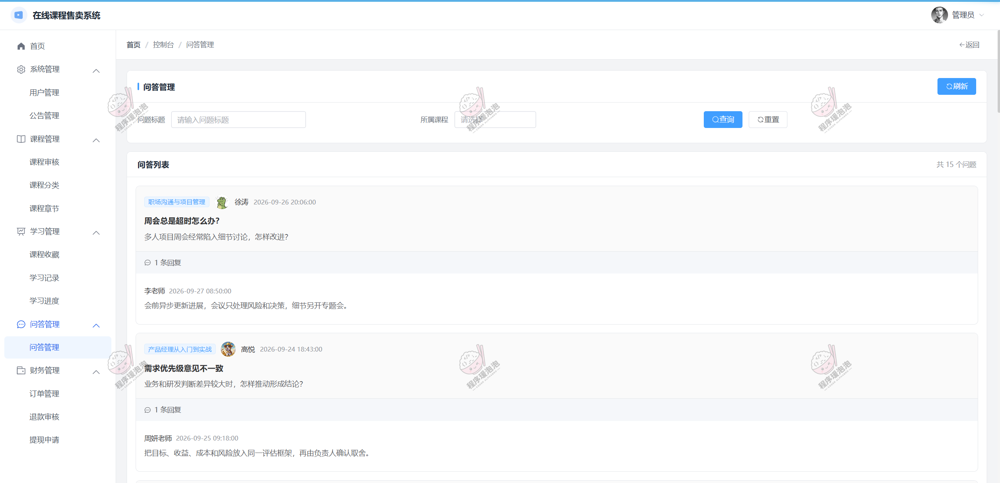

**图 17 · 问答管理**：统一管理课程问答

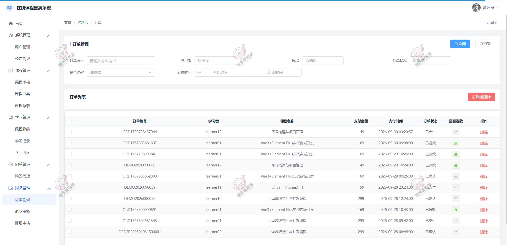

**图 18 · 订单管理**：平台订单查询与处理

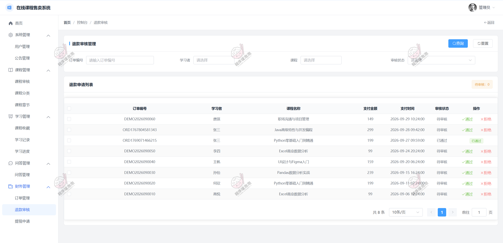

**图 19 · 退款审核**：审核退款申请

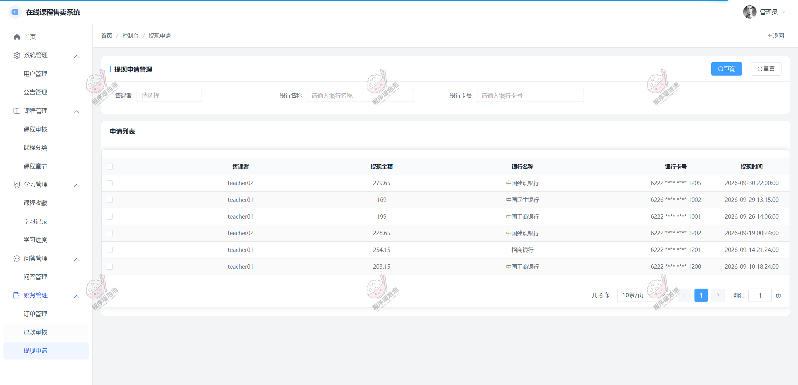

**图 20 · 提现申请**：审批售课者提现

## 五、说明

> 本文档中的界面截图均来自课程设计与开发过程中的实际运行环境，仅用于展示功能与交互流程。

> 本项目仅用于学习交流，非开源、非无偿。

> 文档展示 20 张截图，需要了解更多，请联系我。

